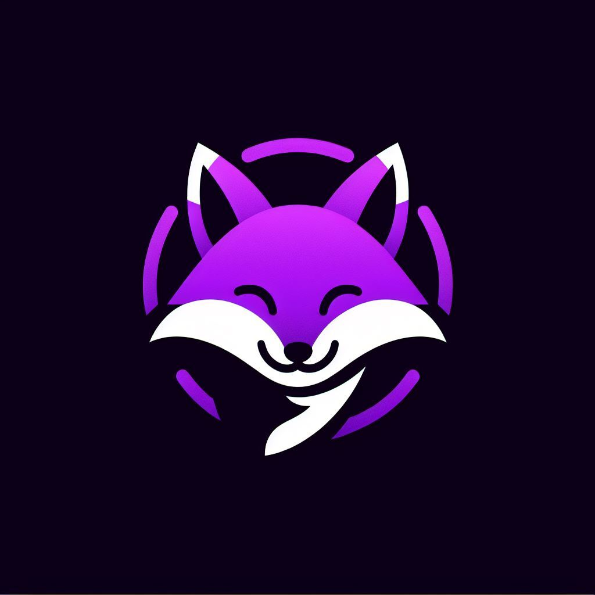

# Nunki | Language Learning Game
> *"Education is not the filling of a pail, but the lighting of a fire." - William Butler Yeats*
<!-- PROJECT LOGO -->
<br />
    
  </a>

<!-- TABLE OF CONTENTS -->
<details>
  <summary>Table of Contents</summary>
  <ol>
    <li>
      <a href="#about-the-project">About The Project</a>
      <ul>
        <li><a href="#project-stack-and-collaboration-tools">Project Stack and Collaboration Tools</a></li>
        <li><a href="#functionality-and-purpose">Functionality and Purpose</a></li>
        <li><a href="#key-features">Key Features</a></li>
      </ul>
    </li>
    <li>
      <a href="#getting-started">Getting Started</a>
      <ul>
        <li><a href="#prerequisites">Prerequisites</a></li>
        <li><a href="#installation">Installation</a></li>
      </ul>
    </li>
    <li><a href="#usage">Usage</a></li>
    <li><a href="#contact">Contact</a></li>
  </ol>
</details>

<!-- ABOUT THE PROJECT -->
## About The Project
**Nunki** is an interactive Language Learning Game that utilizes a sophisticated word generation API to enhance the understanding of different parts of speech in English. The app caters to individual learners and serves as a supplementary teaching tool for educators.


### Project Stack and Collaboration Tools
Our project thrives on a diverse ecosystem of tools and technologies that empower our development and collaboration. Here's a snapshot of the key tools and platforms instrumental in building and managing our project:
* 
* 
* 
* 
* 
* 
* 
* 
* 

### Functionality and Purpose
This Language Learning Game serves as an educational resource to assist individuals in comprehending the parts of speech in English. It addresses the challenges faced by both non-native and native speakers. It offers beginner (A1) level exercises where users practice recognizing parts of speech (e.g., noun, verb, pronoun) within sentences generated by the API.

### Key Features
* Console-based front end
* API calls for sentences paired with their respective parts of speech (e.g., [cat, noun])
* Database integration for word storage
* Game logic for sentence-based activities with user input
* Inclusion of encouraging messages throughout the game

<!-- GETTING STARTED -->
## Getting Started
### Prerequisites
* Python==3.12
* PyCharm Community Edition 2023.3.1
* Flask 2.2.5
* OpenAI==1.3.9
* mysql-connector-python==8.2.0
* requests==2.31.0
* python-dotevn==1.0.0
* pip=23.2.1
* unnittest
* os.path
* String.io
* Sys


### Installation

Below is an example of how you can set up the OpenAI API.

1. Get a secret API Key at [https://platform.openai.com/account/api-keys](https://example.com)
2. Clone the repo
   ```sh
   git clone git@github.com:greeninkpen/Group6_final_project_Software1.git
   ```
3. Install the OpenAI Python library
   ```sh
   pip install --upgrade openai
   ```
4. Enter your API key in `config.py`
   ```py
   OPENAI_API_KEY=abc123
   ```


<!-- USAGE EXAMPLES -->
## Usage
* **Database Setup:** Create a MySQL database using the information provided in the language_game_db.sql file. Execute the SQL script to set up the required tables and schema.

* **Config File Setup:** Ensure to include the corresponding database credentials (username, password, database name) in the configuration file. This allows the application to establish a connection with the MySQL database.

* **Running the Application:** Run the frontend file to start playing the language learning game.

* **Gameplay:** Play several rounds with diverse sentences provided by the game. Attempt to identify various parts of speech within the sentences, such as nouns, verbs, adjectives, etc.

* **Accessing the Glossary:** During gameplay, you have the option to view the glossary. Use this feature to expand your knowledge of language fundamentals. The glossary contains definitions for different parts of speech, aiding in understanding the sentence structure and enhancing language skills.

<!-- CONTACT -->
## Contact
* Alejandra [Github](https://github.com/AlBeker)
* Alexandra [Github](https://github.com/alexfc-code)
* Desiree [Github](https://github.com/greeninkpen)
* Kirsty [Github](https://github.com/cib11164)
* Maria [Github](https://github.com/Mariaherreramateos)
* Morag [Github](https://github.com/Mobit2)

<!-- CFG SOFTWARE ENGINEERING STREAM -->
## CFG Software Engineering Stream | Nunki Team

